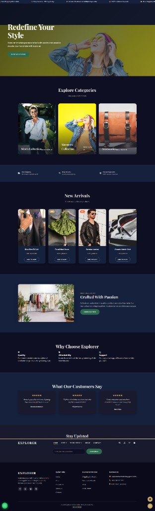
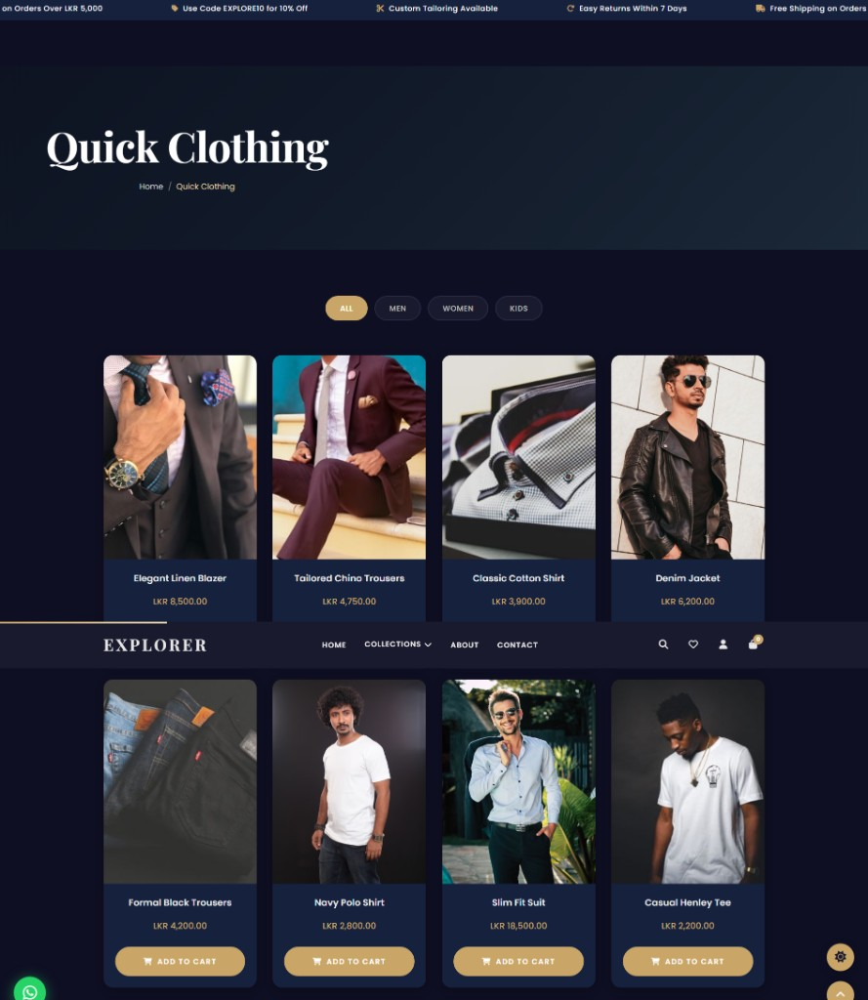
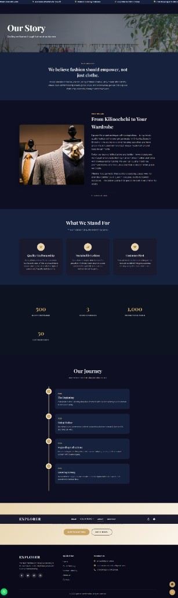
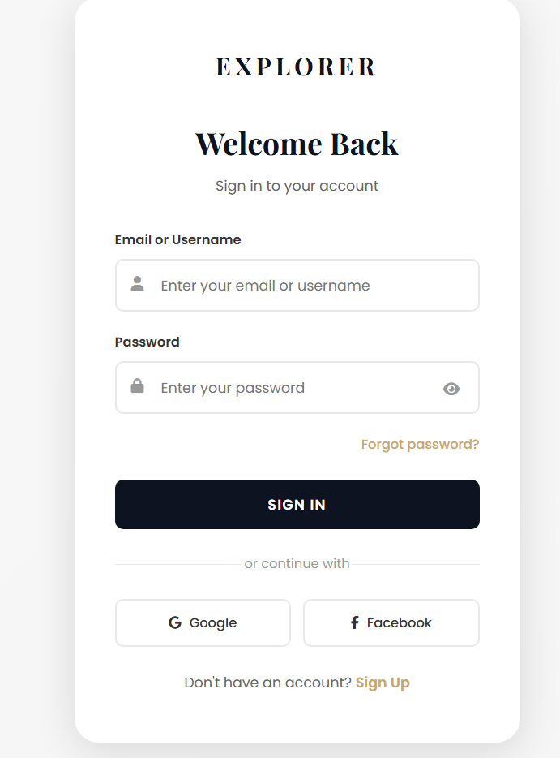

# Explorer Merchandise — Premium Fashion E-Commerce


A full-stack fashion e-commerce platform with a premium UI, admin dashboard, multi-step checkout, and custom tailoring services. Built with a **vanilla JavaScript** frontend and **.NET 8 Web API** backend powered by **PostgreSQL**.

---

## Screenshots

### Homepage


### Product Catalog


### About Page


### Login


---

## Features

### Customer Experience
- Browse products across **Quick Clothing** and **Custom Tailoring** categories
- Add to cart with quantity management (persisted in localStorage)
- **Multi-step checkout** flow: Cart → Shipping → Payment → Confirmation
- Favourites / Wishlist page
- User registration and login with session management
- Dark / Light mode toggle
- Fully responsive design (mobile, tablet, desktop)

### Admin Dashboard
- Secure admin authentication (server-side validation)
- Dashboard with sales statistics and analytics
- Add, manage, and view products and tailoring items
- View customer orders and registrations

### Technical Highlights
- Modern **ES6+ JavaScript** — no jQuery or framework dependencies
- **CSS custom properties** design system with 4,800+ lines of hand-crafted styles
- Playfair Display + Poppins typography pairing
- Dark navy (#0D1321) and warm gold (#C9A668) color palette
- Scroll animations using IntersectionObserver
- Toast notifications, smooth transitions, and parallax effects
- **Authentication guard** system — homepage is public, all other actions require login
- RESTful API with Swagger documentation
- Entity Framework Core with PostgreSQL for persistent data storage

---

## Tech Stack

| Layer | Technology |
|-------|-----------|
| **Frontend** | HTML5, CSS3, Vanilla JavaScript (ES6+) |
| **Backend** | .NET 8 Web API, C# |
| **Database** | PostgreSQL 15+ with Entity Framework Core |
| **API Docs** | Swagger / OpenAPI |
| **Fonts** | Google Fonts (Playfair Display, Poppins) |
| **Icons** | Font Awesome 6.5 |

---

## Project Structure

```
FashionWebsite/
├── frontend/
│   ├── index.html          # Homepage with hero, categories, new arrivals
│   ├── product.html        # Quick Clothing catalog
│   ├── product01.html      # Custom Tailoring catalog
│   ├── login.html          # User & admin authentication
│   ├── register.html       # User registration
│   ├── checkout.html       # Multi-step cart & checkout
│   ├── favourites.html     # Wishlist page
│   ├── about.html          # About us
│   ├── contact.html        # Contact form
│   ├── admin.html          # Admin dashboard
│   ├── css/
│   │   ├── style.css       # Core design system (4,800+ lines)
│   │   ├── checkout.css    # Checkout-specific styles
│   │   └── admin.css       # Admin dashboard styles
│   └── js/
│       ├── app.js          # Core site functionality & auth guard
│       ├── products.js     # Quick Clothing catalog logic
│       ├── clothes.js      # Custom Tailoring catalog logic
│       ├── cart.js          # Cart management & checkout flow
│       └── checkout.js     # Checkout page logic
├── backend/
│   ├── Controllers/
│   │   └── ApiController.cs    # REST API endpoints
│   ├── Data/
│   │   └── AppDbContext.cs     # EF Core database context
│   ├── Models/                 # Entity models (Product, Clothes, Order, User)
│   ├── Program.cs              # App configuration & startup
│   ├── appsettings.json        # Configuration (update DB password)
│   └── FashionWebsite.Api.csproj
└── README.md
```

---

## Getting Started

### Prerequisites

- [.NET 8 SDK](https://dotnet.microsoft.com/download/dotnet/8.0)
- [PostgreSQL 15+](https://www.postgresql.org/download/)
- Any static file server (or `npx serve`)

### 1. Database Setup

Create a PostgreSQL database:

```sql
CREATE DATABASE explorer_merchandise;
```

### 2. Configure Connection String

Update `backend/appsettings.json` with your PostgreSQL credentials:

```json
{
  "ConnectionStrings": {
    "DefaultConnection": "Host=localhost;Port=5432;Database=explorer_merchandise;Username=postgres;Password=YOUR_PASSWORD"
  }
}
```

Or use an environment variable:

```bash
export DATABASE_URL="Host=localhost;Port=5432;Database=explorer_merchandise;Username=postgres;Password=YOUR_PASSWORD"
```

### 3. Run the Backend

```bash
cd backend
dotnet run
```

- API: **http://localhost:5000**
- Swagger Docs: **http://localhost:5000/swagger**

The database tables are auto-created on first run.

### 4. Run the Frontend

```bash
npx serve frontend -l 3000
```

Open **http://localhost:3000** in your browser.

---

## API Endpoints

Base URL: `http://localhost:5000/api/`

| Method | Endpoint | Description |
|--------|----------|-------------|
| POST | `/login` | Authenticate user (returns role: user/admin) |
| POST | `/register` | Register new customer account |
| GET | `/getRegisters` | List all registered users |
| GET | `/getData` | Get all products (Quick Clothing) |
| POST | `/new` | Add new product |
| GET | `/getClothes` | Get all clothes (Custom Tailoring) |
| POST | `/newClothes` | Add new tailoring item |
| GET | `/getOrders` | Get all custom orders |
| POST | `/orders` | Create custom tailoring order |
| POST | `/orderdata` | Submit checkout order data |

---

## License

MIT License - feel free to use this project as a reference or starting point for your own work.
